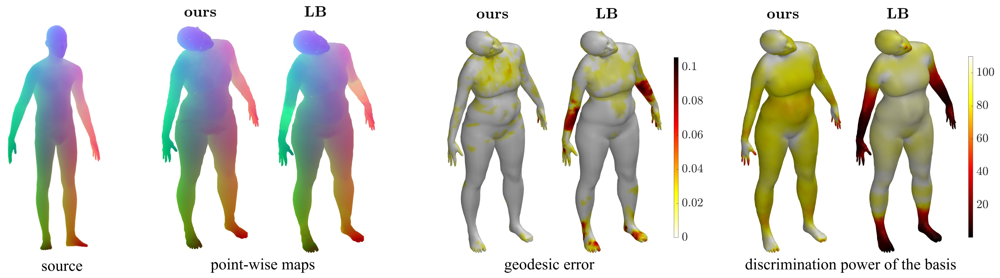
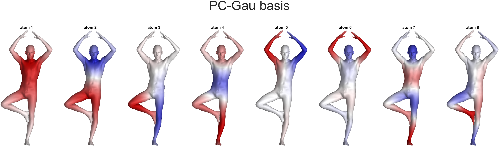
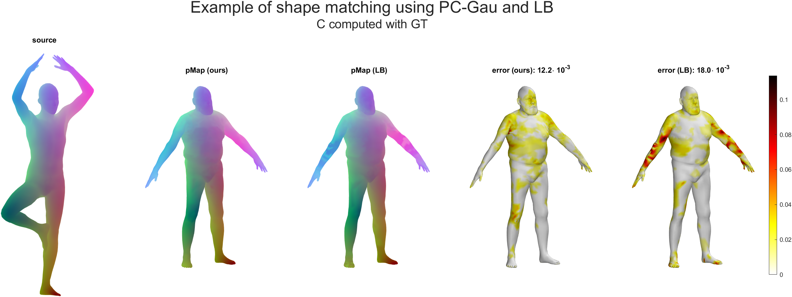
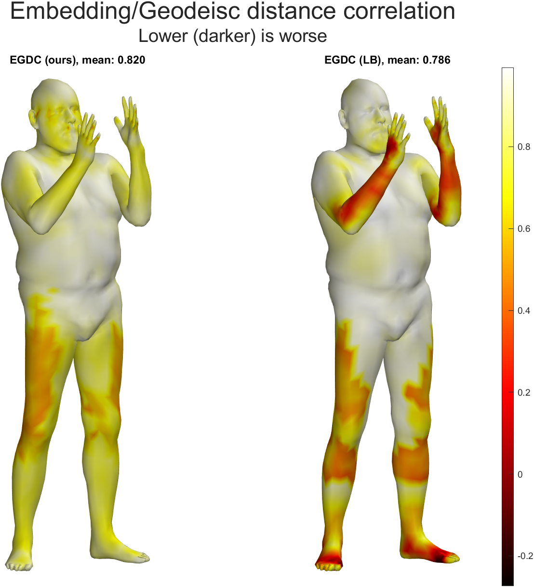
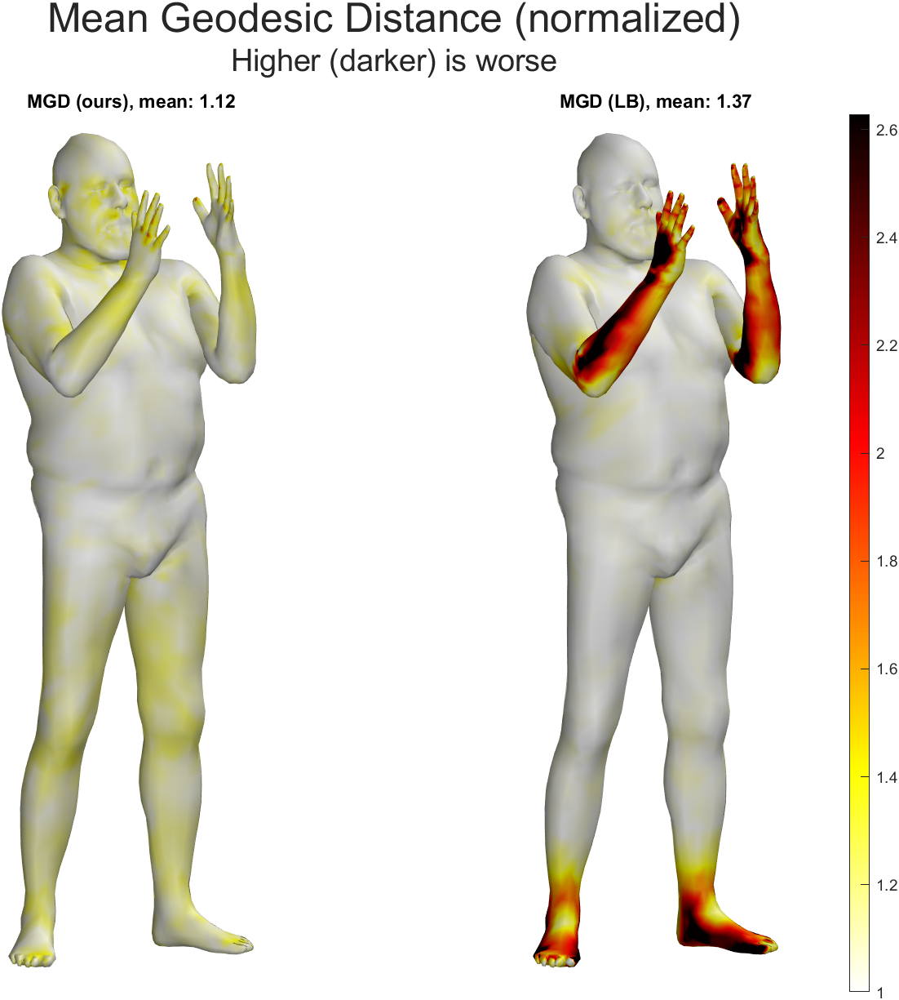
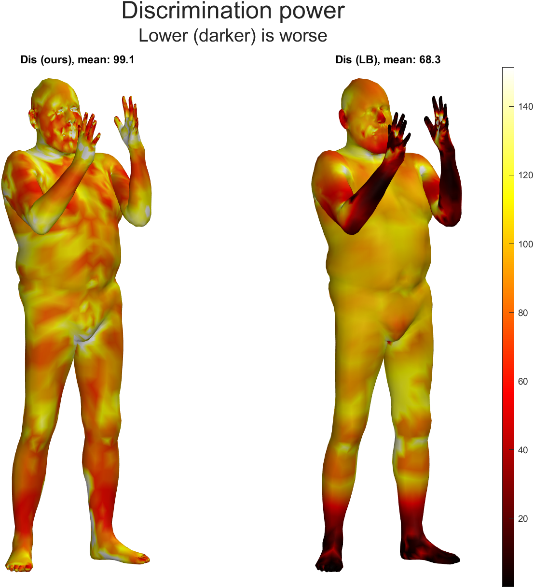

# PC-Gau: PCA basis of Scattered Gaussians for Shape Matching via Functional Maps

This repository contains the demo code for the paper:  Colombo, M. and Boracchi, G. and Melzi, S., PC-Gau: PCA basis of Scattered Gaussians for Shape Matching via Functional Maps.

## Code

The core function provided by the repository is `compute_PC_Gau`, which computes the atoms of PC-Gau basis given an input mesh and the necessary parameters.

There are also two demo scripts that show its usage.

### Demo: point-wise maps

Run `demo_p2p_map.m` to display the atoms of PC-Gau basis and show a comparison between point-wise maps obtained using our basis and the standard LB basis. The output you should get is the following:

You can use both the gournd-truth correspondence and product preservation [[NO17](https://www.lix.polytechnique.fr/~maks/papers/fundescEG17.pdf)] to compute the functional map C, by setting the value of the parameter `C_computation_method`.

### Demo: metrics

You can compute and plot the metrics presented in the paper for a demo shape, using both PC-Gau and LB. To do this, run `demo_display_metrics.m`. The output should look like the following figures:

  

## Acknowledgements

Some of the code present in this repository is not ours. We would like to thank the authors of the following articles:

- Orthogonalized Fourier Polynomials for Signal Approximation and Transfer [[paper](http://www.google.com/url?q=http%3A%2F%2Fwww.lix.polytechnique.fr%2F~maks%2Fpapers%2FEG21_Fourier_polynomials.pdf&sa=D&sntz=1&usg=AOvVaw08iduA4LoPiZ8n2MS6xZoH)] [[code](https://github.com/filthynobleman/orthogonalized-fourier-polynomial)]
- Informative Descriptor Preservation via Commutativity for Shape Matching [[paper](https://www.lix.polytechnique.fr/~maks/papers/fundescEG17.pdf)] [[code](https://www.lix.polytechnique.fr/~maks/code/Commute_Fmap_basic_demo.zip)]

